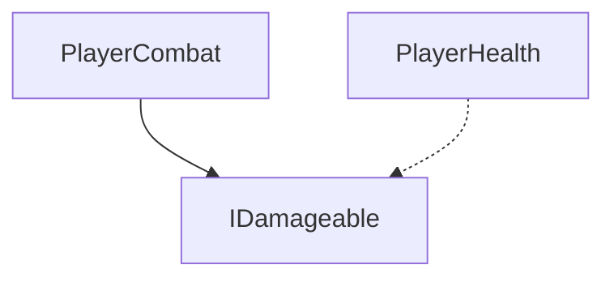
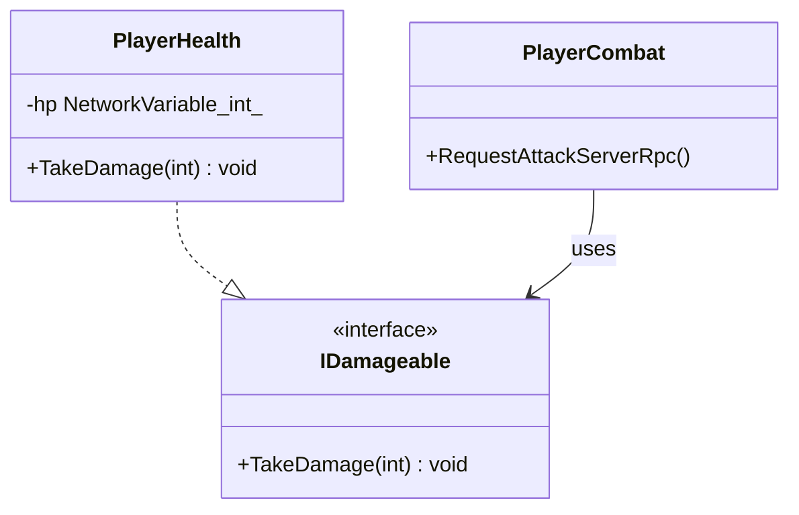

# [COMBAT] 카테고리 청사진

> 최종 갱신: 2026-03-15 | 갱신 이유: 초기 청사진 작성

---

## 파일 구조

```
Assets/Scripts/Interface/
└── IDamageable.cs         ← 단일 피격 통합 인터페이스
Assets/Scripts/Player/
├── PlayerHealth.cs        ← (PLAYER 영역에 위치함) 서버 권위 체력 
└── PlayerCombat.cs        ← (PLAYER 영역에 위치함) 공격 요청 및 범위 판정
```
(COMBAT 카테고리는 현재 PLAYER 내의 스크립트와 통합된 상태로 존재합니다.)

## 파일별 책임

| 파일 | 책임 |
|------|------|
| `IDamageable.cs` | 아군/적군 공통으로 피격을 받을 수 있는 엔티티의 타격 인터페이스 정의 (`TakeDamage`). |
| `PlayerHealth.cs` | NetworkVariable<int>로 플레이어 HP 상태 동기화 및 사망 처리. |
| `PlayerCombat.cs` | 로컬 입력 시 공격 요청(ServerRpc) 처리 및 서버에서의 데미지 검증, 거리 연산. |

## 카테고리 내 의존성



## 타 카테고리 의존성

```
이 카테고리(COMBAT) → MONSTER (타겟팅 판정 시 MonsterHealth의 IDamageable 상호작용)
```

## UML 다이어그램



## 네트워크 권위 테이블

| 상태 | 소유자 | 동기화 방식 |
|------|--------|-------------|
| 플레이어 / 몬스터 체력 | 서버 | `NetworkVariable<int>` |
| 물리적인 공격 시도 | 클라이언트 → 서버 | `ServerRpc` |
