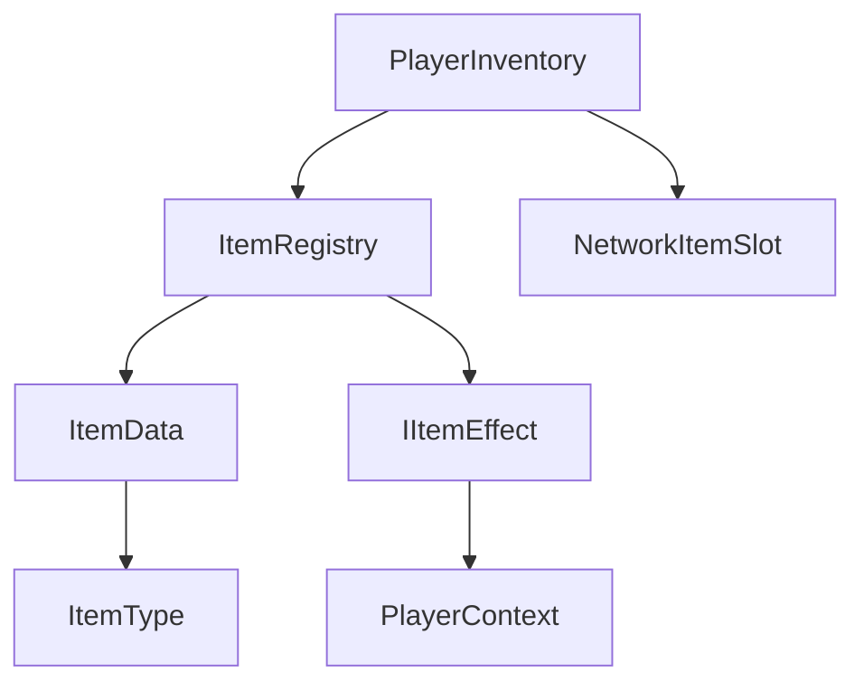
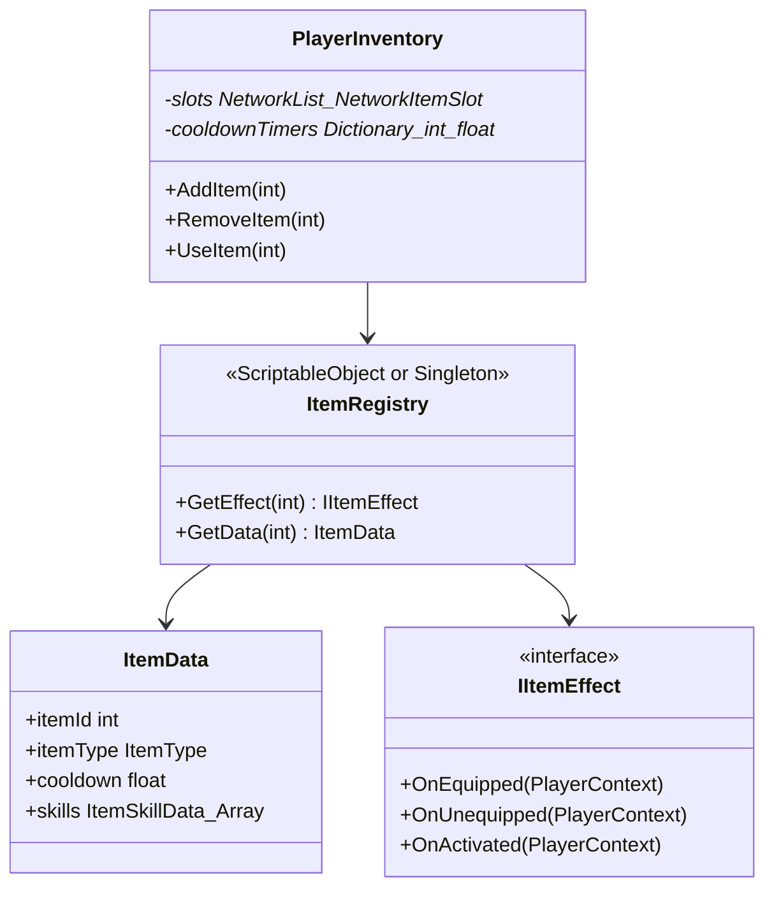

# [ITEM] 카테고리 청사진

> 최종 갱신: 2026-03-15 | 갱신 이유: 기능 설계 문서(20_role_item_skill_design) 기반 구조 및 의존성 정립 완료

---

## 파일 구조

```
Assets/Scripts/Item/
├── ItemType.cs             ← (예정) 아이템 타입 Enum (Passive, Active)
├── ItemData.cs             ← (예정) 소비형/패시브 중심 스탯, 쿨다운(SO)
├── IItemEffect.cs          ← (예정) 로직(C#)으로 즉시 적용되는 효과(프로그래매틱 효과)를 위한 인터페이스
├── PlayerContext.cs        ← (예정) 아이템 적용 시 넘겨줄 플레이어 컴포넌트 묶음 구조체
├── NetworkItemSlot.cs      ← (예정) 인벤토리에 들어갈 INetworkSerializable 구조체 (itemId만 담음)
├── ItemRegistry.cs         ← (예정) itemId(int)로 ItemData와 IItemEffect 구현체를 반환하는 사전(딕셔너리) 제공처
├── PlayerInventory.cs      ← (예정) 슬롯, 습득 관리 네크워크 리스트 (`NetworkList<NetworkItemSlot>`)
└── Effects/                ← (예정) IItemEffect 구현체들이 위치할 폴더 (예: HpBonusEffect)
```

## 파일별 책임

| 파일 | 책임 |
|------|------|
| `ItemType.cs` | 사용 가능한(Active) 소비템인지, 장착만 하는 패시브(Passive)템인지 구분. |
| `ItemData.cs` | 아이템 ID, 쿨다운, 장착 가능 직업, 스킬 리스트(`ItemSkillData`) 규정. |
| `ItemRegistry.cs` | 서버 및 클라이언트가 네트워크 전송된 ID만 보고도 실체 데이터 객체에 빠르게 접근하도록 연결고리 제공. |
| `IItemEffect.cs` | "체력 50 증가" 등 즉시 실행(프로그래매틱) 되어야 하는 순수 코드 로직 효과. (이벤트 기반 스킬과 다름) |
| `PlayerInventory.cs` | 습득한 아이템을 인벤토리 슬롯 서버 권위 NetworkList로 동기화. 아이템 습득/해제 시 `IItemEffect` 발동 및 `SkillConditionMonitor` 갱신 지시. 서버 쿨타임 검증 포함. |

## 카테고리 내 의존성



## 타 카테고리 의존성

```
이 카테고리(ITEM) → PLAYER (PlayerContext를 매개로 Health 직접 회복 등 코드 적용)
이 카테고리(ITEM) → SKILL (PlayerInventory가 ItemData 내부의 스킬 리스트를 SkillConditionMonitor에 등록)
```

## UML 다이어그램



## 네트워크 권위 테이블

| 상태 | 소유자 | 동기화 방식 |
|------|--------|-------------|
| 현재 소지품 (인벤) | 서버 | `NetworkList<NetworkItemSlot>` (내부적으로 int id 전송) |
| 아이템 사용 | 클라이언트 → 서버 | `ServerRpc` 호출 후, 유효성/쿨타임 검사 성공 시 서버 적용. (클라이언트 일회성 시각화 필요 시 `ClientRpc`) |
| 액티브 쿨타임 | 서버 | 서버 로컬 Dictionary로 검증 (클라이언트는 자체 예측 시각화) |
