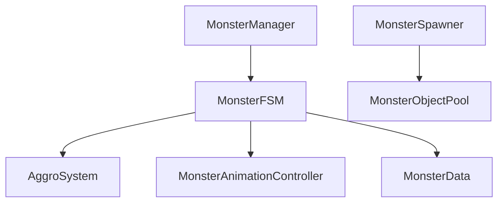
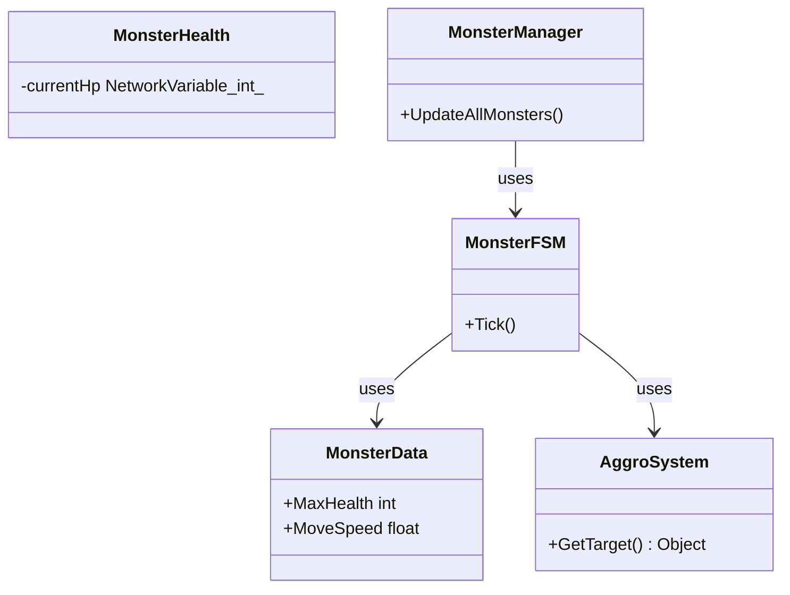

# [MONSTER] 카테고리 청사진

> 최종 갱신: 2026-03-15 | 갱신 이유: 초기 청사진 작성

---

## 파일 구조

```
Assets/Scripts/Monster/
├── MonsterData.cs                ← 몬스터 기본 스탯 (SO)
├── MonsterHealth.cs              ← 몬스터 체력 관리
├── MonsterAnimationController.cs ← 몬스터 애니메이션 네트워크 동기화
├── MonsterFSM.cs                 ← 서버 권위 몬스터 인공지능 상태 머신
├── AggroSystem.cs                ← 어그로 점수 누산 체계
├── MonsterManager.cs             ← 중앙 집중 인공지능 티킹/최적화
├── MonsterSpawner.cs             ← 서버 전용 구역별 몬스터 랜덤 스폰 관리
└── MonsterObjectPool.cs          ← 비용 절감을 위한 스폰 객체 풀
```

## 파일별 책임

| 파일 | 책임 |
|------|------|
| `MonsterData.cs` | 스크립터블 오브젝트(SO)로 체력, 이동 속도, 공격력 등 설정 수치 저장. |
| `MonsterHealth.cs` | 서버에서 `IDamageable`을 바탕으로 체력 동기화, 사망 시 오브젝트 비활성화 처리. |
| `MonsterAnimationController.cs` | NetworkVariable로 서버 상태 추적 및 FSM 애니메이션 전환. |
| `MonsterFSM.cs` | 탐지, 추적, 대기, 공격의 일련 로직을 관장 (서버단에서 실행). |
| `AggroSystem.cs` | 거리, 플레이어 데미지를 누적하여 몬스터의 현재 타겟을 재조정. |
| `MonsterManager.cs` | 활성화 몬스터의 전체 반복(Update)을 관리 및 분산하여 프레임 최적화. |
| `MonsterSpawner.cs` | 주어진 주기마다 NavMesh 위 일정 범위 내에 몬스터를 스폰하고 풀과 연동. |
| `MonsterObjectPool.cs` | 삭제(Destroy) 대신 인스턴스를 보관하여 성능 저하 최소화. |

## 카테고리 내 의존성



## 타 카테고리 의존성

```
이 카테고리(MONSTER) → COMBAT (IDamageable 호환 기능 탑재, Player 대상 타격)
이 카테고리(MONSTER) → PLAYER (어그로 시스템 시 PlayerController 위치 기반 거리 연산)
```

## UML 다이어그램



## 네트워크 권위 테이블

| 상태 | 소유자 | 동기화 방식 |
|------|--------|-------------|
| 몬스터 Transform | 서버 | `NetworkTransform` 내장 |
| AI 상태, 행동(FSM) | 서버 | 서버 자체 처리 + `NetworkVariable<byte>` (클라 애니메이션 반영) |
| 어그로 정보 | 서버 | 동기화 없음 (단순 타겟 추적의 결과물로 방향만 공유됨) |
| 체력(HP) | 서버 | `NetworkVariable<int>` |
| 스폰/해제 (객체) | 서버 | `NetworkObject.Spawn/Despawn` |
