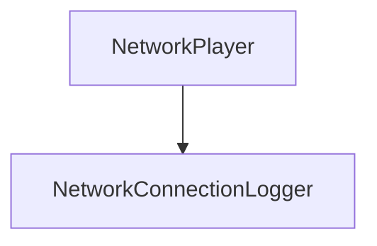
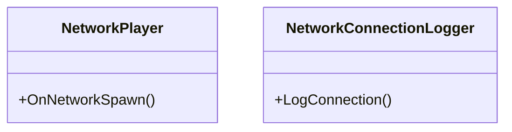

# [NET] 카테고리 청사진

> 최종 갱신: 2026-03-15 | 갱신 이유: 초기 청사진 작성

---

## 파일 구조

```
Assets/Scripts/Network/
├── NetworkConnectionLogger.cs ← 연결 정보 로깅 및 디버깅
└── NetworkPlayer.cs           ← 플레이어 스폰 시 NetworkObject 기본 관리
```

## 파일별 책임

| 파일 | 책임 |
|------|------|
| `NetworkConnectionLogger.cs` | 네트워크 접속, 끊김, 플레이어 스폰 등의 네트워크 연결 이벤트를 콘솔에 로깅하여 상태를 확인합니다. |
| `NetworkPlayer.cs` | 초기 네트워크 스폰 시 필요한 기본 변수와 처리를 포함하며, 다른 플레이어와의 동기화 기초를 마련합니다. |

## 카테고리 내 의존성



## 타 카테고리 의존성

```
이 카테고리(NET) → Unity.Netcode (NGO)
```

## UML 다이어그램



## 네트워크 권위 테이블

| 상태 | 소유자 | 동기화 방식 |
|------|--------|-------------|
| 세션 연결/해제 | 서버 (Host) | NGO 기본 이벤트 핸들러 |
