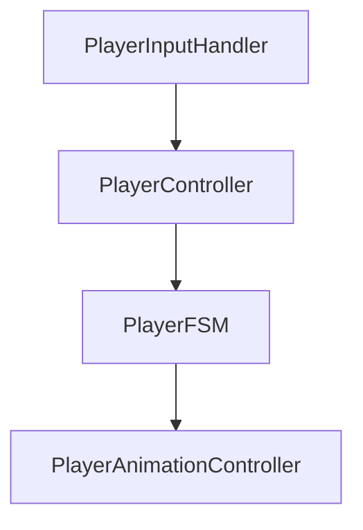
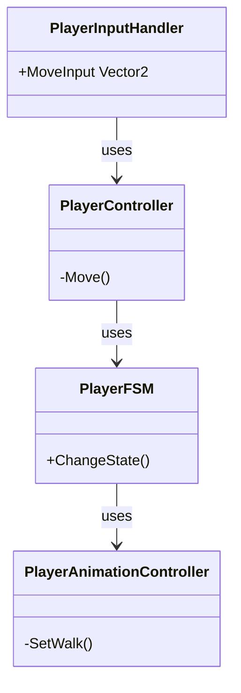

# [PLAYER] 카테고리 청사진

> 최종 갱신: 2026-03-15 | 갱신 이유: 초기 청사진 작성

---

## 파일 구조

```
Assets/Scripts/Player/
├── PlayerController.cs          ← 이동, 회전 등 물리 제어 로직
├── PlayerInputHandler.cs        ← Input System에서 입력 값 추출
├── PlayerAnimationController.cs ← 네트워크 Animator 상태 동기화 관리
└── PlayerFSM.cs                 ← 플레이어 상태 머신 (Idle, Walk, Attack 등)
```

## 파일별 책임

| 파일 | 책임 |
|------|------|
| `PlayerController.cs` | 서버 권위 이동 적용 및 클라이언트 입력 기반의 CharacterController 핸들링. |
| `PlayerInputHandler.cs` | 로컬 클라이언트의 입력을 읽고 Unity Event로 발송하여 Controller에 전달. |
| `PlayerAnimationController.cs` | NetworkVariable로 서버/클라이언트의 Animator Parameter(Walk 등) 동기화. |
| `PlayerFSM.cs` | 플레이어의 현재 상태(상태 머신)를 정의하고 상태별(Update, Enter, Exit) 로직 처리. |

## 카테고리 내 의존성



## 타 카테고리 의존성

```
이 카테고리(PLAYER) → COMBAT (PlayerCombat, PlayerHealth 접근)
이 카테고리(PLAYER) → WEAPON (장착한 WeaponData 기반 동작 변경 시 접근)
```

## UML 다이어그램



## 네트워크 권위 테이블

| 상태 | 소유자 | 동기화 방식 |
|------|--------|-------------|
| 이동(NetworkTransform) | 서버 (NGO 디폴트) | `NetworkTransform` 내장 동기화 |
| 입력 값 | 클라이언트 | Event Action 로컬 발송 (클라 단독 처리 후 이동 적용) |
| 애니메이션 상태 | 서버 | `NetworkVariable<byte>` 방식 |
