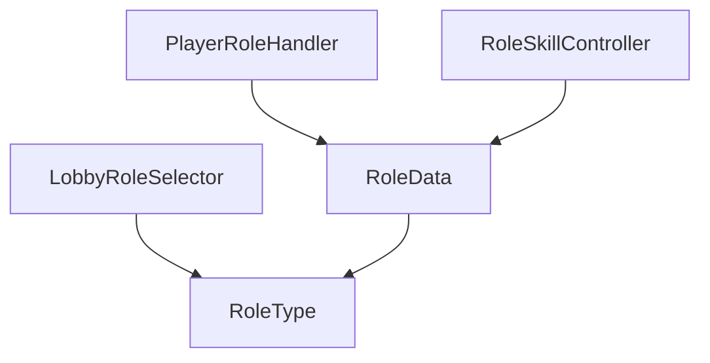
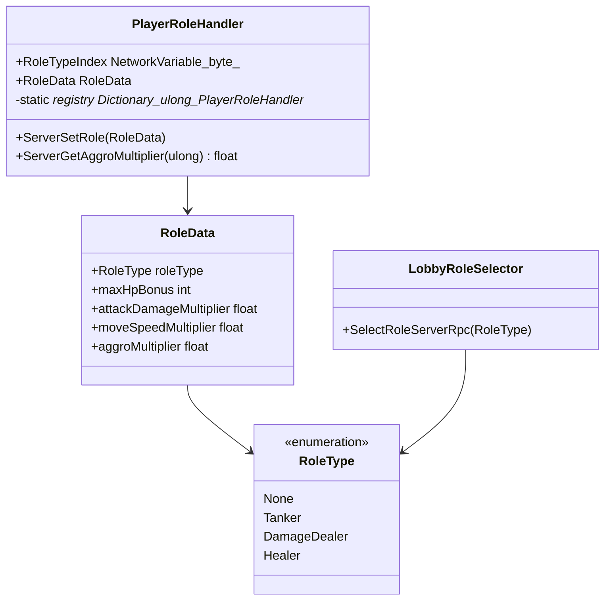

# [ROLE] 카테고리 청사진

> 최종 갱신: 2026-03-15 | 갱신 이유: 기능 설계 문서(20_role_item_skill_design) 기반 설계 구체화 및 구조 검증 완료

---

## 파일 구조

```
Assets/Scripts/Role/
├── RoleType.cs             ← 직업 타입 Enum (Tanker, DamageDealer, Healer, None)
├── RoleData.cs             ← 직업별 기본 스탯/배율 정의 (SO)
├── LobbyRoleSelector.cs    ← 로비/인게임 직업 선택 로직 동기화 관리
├── PlayerRoleHandler.cs    ← (신규예정) 인게임 플레이어 역할 정보 유지, 스탯 초기화 트리거 및 Aggro 배율 조회용 Registry
└── RoleSkillController.cs  ← (예정) DPS용 대쉬, 전용 무적 플래그 등 직업별 고유 조작 처리 (향후 STATUS 통합 가능성 있음)
```

## 파일별 책임

| 파일 | 책임 |
|------|------|
| `RoleType.cs` | 명시적인 역할군(탱크, 딜러, 힐러 등)을 규정하는 열거형. |
| `RoleData.cs` | 지정된 역할군의 기초 체력 배율(또는 절대값 `maxHpBonus`), 어그로 배율(`aggroMultiplier`), 이속 배율 등 기초 패시브 속성 제공 (SO). |
| `LobbyRoleSelector.cs` | 각 플레이어가 직업을 중복 없이 선택 및 변경하는 것을 서버 통신으로 검증하고 저장하는 중앙 관리자. |
| `PlayerRoleHandler.cs` | 로컬 스폰 직후 선택된 역할을 기반으로 `PlayerHealth`, `PlayerController`에 초기 설정값을 밀어넣고(Push), 타 시스템(AggroSystem)이 스탯 배율을 빠르게 O(1) 조회할 수 있게 static Registry 제공. |
| `RoleSkillController.cs` | DPS 직업군의 회피/전방 대쉬 등 단순 직업 전용 특수 조작 담당. |

## 카테고리 내 의존성



## 타 카테고리 의존성

```
이 카테고리(ROLE) → PLAYER (PlayerRoleHandler가 PlayerHealth, PlayerController의 Initialize 메서드를 호출하여 스탯 반영)
MONSTER → 이 카테고리(ROLE) (AggroSystem이 데미지 정산 시 PlayerRoleHandler.ServerGetAggroMultiplier를 직접 호출)
WEAPON → 이 카테고리(ROLE) (무기 장착 가능 직업 제한 시 RoleType 참조)
```

## UML 다이어그램



## 네트워크 권위 테이블

| 상태 | 소유자 | 동기화 방식 |
|------|--------|-------------|
| 직업 선택 변경 요청 | 클라이언트 → 서버 | `ServerRpc` 처리 후 리스트 갱신 (LobbyRoleSelector) |
| 전체 유저 직업 할당 리스트 | 서버 | 로컬 Dictionary 관리 및 실패 시 `ClientRpc` 응답 |
| 게임 내 플레이어 역할 타입 | 서버 | `NetworkVariable<byte>` 로 전 클라이언트 동기화 (PlayerRoleHandler) |
| 기초 스탯 재계산 (최대 HP 등) | 서버 | 서버에서 계산 후 개별 컴포넌트(PlayerHealth)의 동기화 로직에 위임 |
