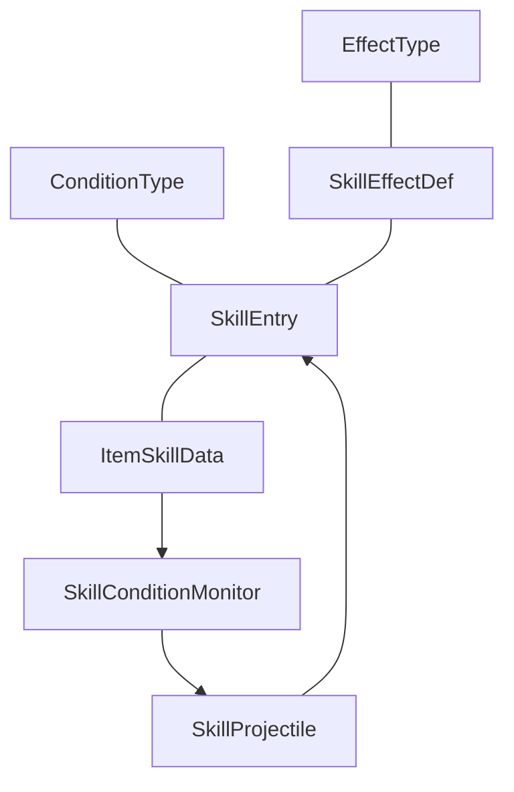
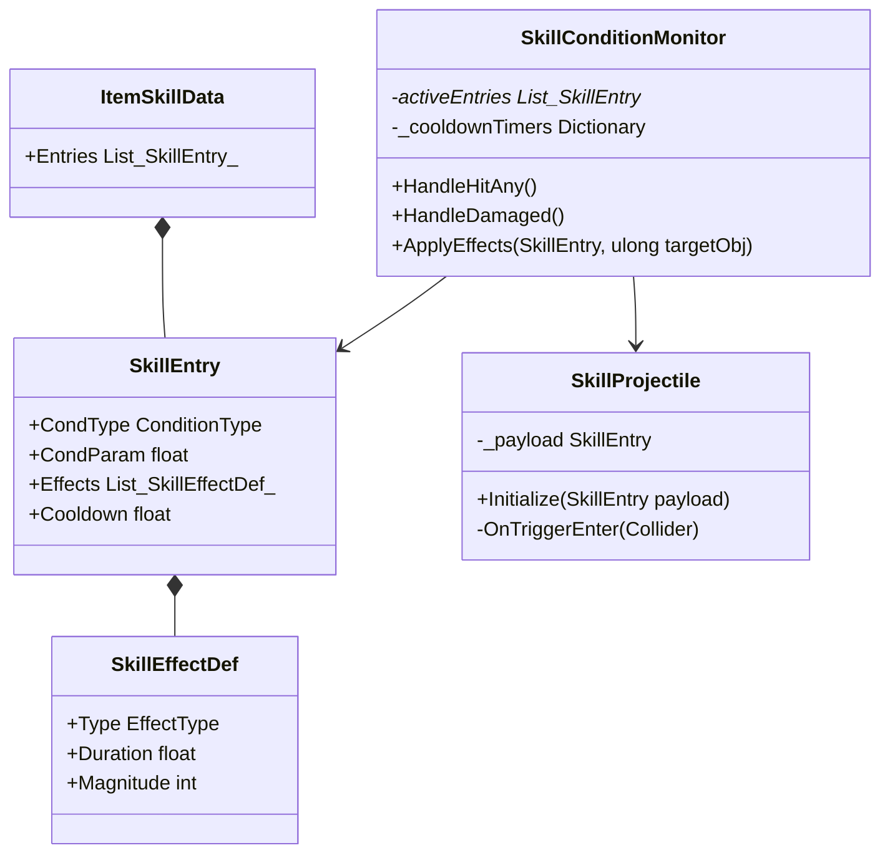

# [SKILL] 카테고리 청사진

> 최종 갱신: 2026-03-15 | 갱신 이유: 조건 기반 발동 프레임워크 설계(20_role_item_skill_design, skill_system_plan) 적용

---

## 파일 구조

```
Assets/Scripts/Skill/
├── ConditionType.cs         ← (예정) Enum (Time, HitAny, HitN, Damaged, Kill 등)
├── EffectType.cs            ← (예정) Enum (Damage, Stun, 번역된 상태 버프/디버프들 + Projectile)
├── SkillEffectDef.cs        ← (예정) 효과 지속시간, 수치 등 세부 결정 속성
├── SkillEntry.cs            ← (예정) [1개의 Condition + 세트 Effect들 + 쿨다운] 단위 구조체
├── ItemSkillData.cs         ← (예정) 무기, 아이템에 귀속될 '스킬 카탈로그' 배열 (SO)
├── SkillConditionMonitor.cs ← (예정) Player 내장, 조건 감지 및 연쇄 로직의 심장 (서버 권위)
└── SkillProjectile.cs       ← (예정) Payload 형태의 하위 효과를 실어 나르는 범용 투사체 서버 로직
```

## 파일별 책임

| 파일 | 책임 |
|------|------|
| `ConditionType` / `EffectType` | 어떤 상황에 터질지, 무엇을 유발할지 결정하는 Enum 사전. |
| `SkillEntry`, `SkillEffectDef` | 직렬화(`[Serializable]`)된 데이터로서, 기획자가 인스펙터에서 조건-효과의 조합을 찍어내는 레고 블럭. |
| `ItemSkillData.cs` | 아이템 1개가 들고 있는 수많은 수동/패시브 스킬들의 집합 객체. |
| `SkillConditionMonitor.cs` | 스폰 시 및 아이템 교체 시 `ItemSkillData`를 읽어들임. `PlayerCombat.OnHitTarget` 등 외부 이벤트를 구독하여 `CondType`이 일치하면 쿨타임 검증 후 내부의 `Effects`를 `IStatusEffectable`에 뿌려 발동시킴. |
| `SkillProjectile.cs` | 효과 타입이 `Projectile` 일 때 생성됨. `SkillEntry`(페이로드 데이터)를 건네받고 날아가다가, 타격에 성공하면 그 대상에게 페이로드를 폭발(조건 없이 효과 적용)시킴. |

## 카테고리 내 의존성



## 타 카테고리 의존성

```
이 카테고리(SKILL) → PLAYER (PlayerHealth.OnTakeDamage, PlayerCombat.OnHitTarget 등을 SkillConditionMonitor가 Event Subscribing 하여 감시)
이 카테고리(SKILL) → STATUS (효과 발동 시 대상의 IStatusEffectable.ApplyEffect 직접 호출)
```

## UML 다이어그램



## 네트워크 권위 테이블

| 상태 | 소유자 | 동기화 방식 |
|------|--------|-------------|
| 피격, 타격 여부 조건 체크 | 서버 | 클라이언트 로컬 신뢰 안함. 서버 내부 이벤트(C# Action) 수신으로 판별 |
| 스킬 대상에게 효과 부여 연산 | 서버 | `ApplyEffects` 를 통해 `IDamageable` 서버 로직 직접 타격 및 STATUS `NetworkList` 조작 |
| 스킬 투사체 궤적 | 서버 | `NetworkObject.Spawn` 이후 `NetworkTransform` 물리 위치 전송 |
| 스킬 폭발 시각 효과(VFX) | 서버 → 클라이언트 | 필요시 `ClientRpc`를 쏴서 대상 위치에 파티클 생성 명시 |
| 스킬 쿨다운 타이머 | 서버 | 클라이언트 UI는 자체 로컬 타이머로 어림짐작(예측), 실제 통과는 서버만 확인 |
