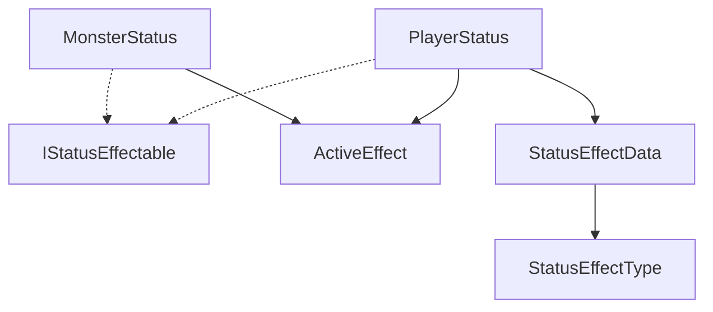
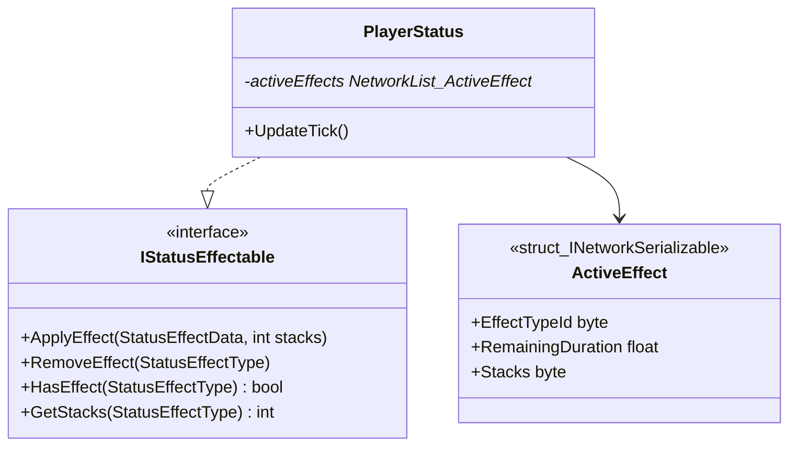

# [STATUS] 카테고리 청사진

> 최종 갱신: 2026-03-15 | 갱신 이유: 기능 설계 문서(20_role_item_skill_design, status_effects_plan) 기반 서버/클라 동기화 및 틱 구조 구체화

---

## 파일 구조

```
Assets/Scripts/Status/
├── StatusEffectType.cs      ← Enum (Wound, Stun, Poison, Burn, Fatigue, Slow, Invincible, Stealth, Valor, Haste, Fortify)
├── StatusTargetType.cs      ← Enum (Self, Ally, Enemy, Any) — 효과 적용 가능 대상 범주
├── StatusEffectData.cs      ← 지속시간·스택 상한·즉발여부·대상범주 정의 SO
├── ActiveEffect.cs          ← INetworkSerializable 구조체 (effectTypeId, 남은시간, 현재 스택)
├── IStatusEffectable.cs     ← 버프/디버프가 걸릴 수 있는 컴포넌트의 추상화 규약
├── StatusBehaviour.cs       ← NetworkBehaviour 추상 기반 (NetworkList 관리, 틱, IStatusEffectable 구현)
├── PlayerStatus.cs          ← StatusBehaviour 상속 — 플레이어 측
└── MonsterStatus.cs         ← StatusBehaviour 상속 — 몬스터 측
```

## 파일별 책임

| 파일 | 책임 |
|------|------|
| `StatusEffectType.cs` | 상태 효과의 고유 ID 역할을 하는 열거형. |
| `StatusTargetType.cs` | 효과 적용 가능 대상 범주 (Self / Ally / Enemy / Any). |
| `StatusEffectData.cs` | 효과의 최대 지속 시간, 최대 중첩 가능 스택 수, 즉발 여부(`isInstant`), 대상 범주(`targetType`) 정의 SO. |
| `ActiveEffect.cs` | 실행 중인 개별 상태 인스턴스. 남은 유지 시간 등을 NetworkList로 전송하기 위해 가볍게 구현. |
| `IStatusEffectable.cs` | Apply, Remove, HasEffect 등 동일한 인터페이스로 몬스터나 플레이어 구분 없이 상태를 조작하기 위함. |
| `PlayerStatus` / `MonsterStatus` | `IStatusEffectable`의 실제 구현체. 서버 권위로 매 초마다 남은 지속시간(`RemainingDuration`)을 갱신하고, 만료 시 리스트에서 제거함. 클라에게는 UI 표시를 위해 자동 동기화. |

## 카테고리 내 의존성



## 타 카테고리 의존성

*이 카테고리는 **Passive**하게 참조되는 데이터 제공처로 주로 쓰입니다.*

```
PLAYER → 이 카테고리(STATUS)
  (PlayerHealth.ApplyDamage가 피격 전 PlayerStatus.HasEffect(Invincible) 확인)
  (PlayerHealth.ApplyHeal가 PlayerStatus.GetStacks(Wound) 확인하여 힐량 감소)
  (PlayerController가 이동 전 Stun/Slow 여부 확인)

MONSTER → 이 카테고리(STATUS)
  (MonsterFSM 틱 중 Stun 감지 시 조기 탈출, Aggro 탐지 중 상대방 Stealth 필터링)

SKILL → 이 카테고리(STATUS)
  (SkillConditionMonitor가 효과 발생 시 IStatusEffectable.ApplyEffect 직접 호출)
```

## UML 다이어그램



## 네트워크 권위 테이블

| 상태 | 소유자 | 동기화 방식 |
|------|--------|-------------|
| 현재 걸려있는 버프/디버프 목록 | 서버 | `NetworkList<ActiveEffect>` 를 통해 지속 시간 및 스택 전 클라이언트 중계 |
| 지속시간 감소 틱 처리 | 서버 | 서버 Update가 단독으로 RemainingDuration 차감 및 네트워크 동기화 트리거 (초 단위) |
