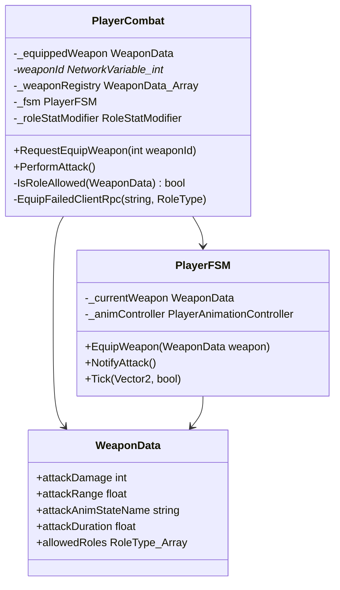

# [WEAPON] 카테고리 청사진

> 최종 갱신: 2026-03-16 | 갱신 이유: WEAPON-02/03 구현 완료 반영 — RequestEquipWeapon/IsRoleAllowed 추가, UnequipWeapon·FSM 에디터 테스트 제거

---

## 파일 구조

```
Assets/Scripts/Player/
├── WeaponData.cs      ← 무기 기본 스탯, 장착 제한 직업(allowedRoles), 애니메이션 상태명 정의 (SO)
├── PlayerCombat.cs    ← 무기 교체 RPC(RequestEquipWeapon), 직업 제한 검증(IsRoleAllowed), 공격 데미지 반영
└── PlayerFSM.cs       ← EquipWeapon(WeaponData) 수신 → 공격 애니메이션 상태명·지속시간 교체 (서버 전용)
```

## 파일별 책임

| 파일 | 책임 |
|------|------|
| `WeaponData.cs` | 기본 공격력, 타격 범위, 장착 가능한 직업군(`allowedRoles`), 공격 애니메이션 상태명·지속시간 보관. |
| `PlayerCombat.cs` | `RequestEquipWeapon(int)` 공개 API → `EquipWeaponServerRpc` → `ServerEquip()` 검증(범위+직업) → `NetworkVariable<int>` 갱신 → `ApplyWeaponLocally()`. 실패 시 `EquipFailedClientRpc`로 오너에게 통보. |
| `PlayerFSM.cs` | `EquipWeapon(WeaponData)` 수신 전용. `_animController.SetAttackStateName()` + `_currentWeapon` 갱신만 담당. `PlayerCombat.ApplyWeaponLocally()`가 서버에서 호출. |

## 카테고리 내 의존성

*이 카테고리는 독립적인 매니저 클래스를 생성하지 않고 PLAYER 카테고리(`PlayerCombat`)에 스며드는 형태로 설계되었습니다.*

## 타 카테고리 의존성

```
이 카테고리(WEAPON) → ROLE (PlayerCombat 내부에서 RoleType을 참조하여 장착 검증)
이 카테고리(WEAPON) → SKILL (WeaponData 하위에 ItemSkillData 속성을 포함)
```

## UML 다이어그램



## 네트워크 권위 테이블

| 상태 | 소유자 | 동기화 방식 |
|------|--------|-------------|
| 무기 장착/교체 요청 | 클라이언트 → 서버 | `ServerRpc` |
| 직업 제한 등으로 장착 실패 알림 | 서버 → 클라이언트 | `ClientRpc` 로 1회성 통보 |
| 현재 갱신된 장착 무기 인덱스 | 서버 | `NetworkVariable<int>` 를 통해 모든 클라이언트에 외형 동기화 수행 |
